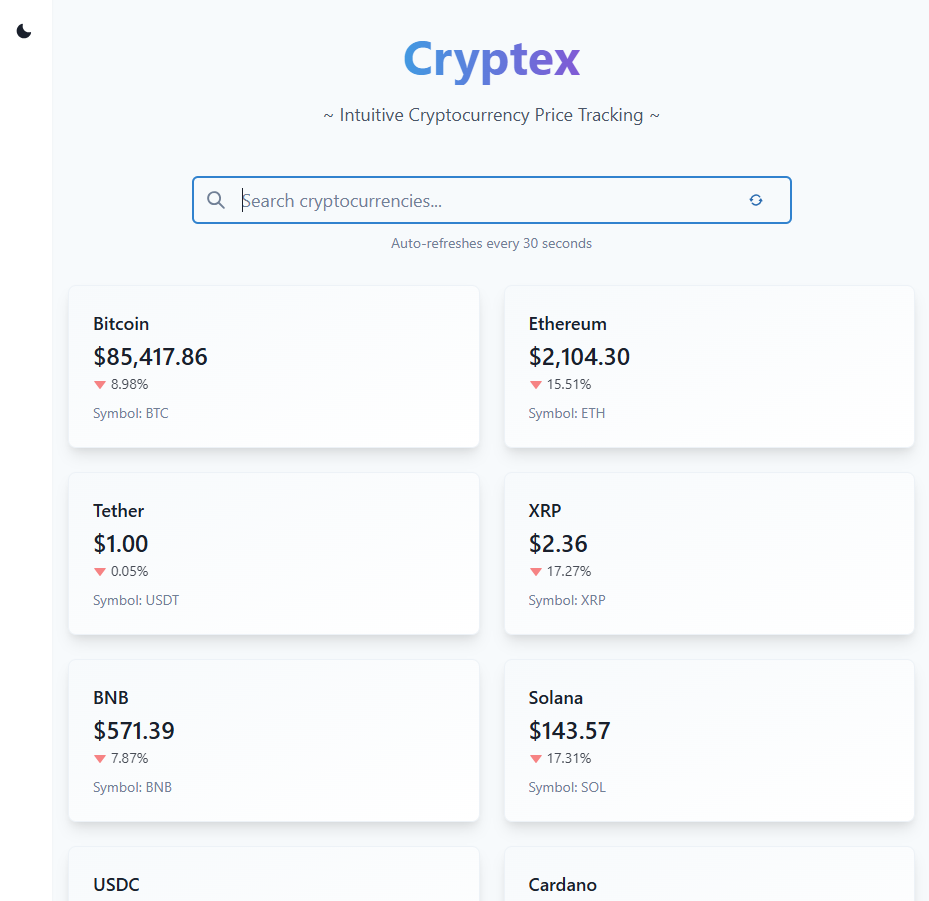

# Cryptex


~ intuitive cryptocurrency price tracking ~

A modern cryptocurrency price tracking application featuring real-time updates, responsive design, and comprehensive documentation.

## Features

- Real-time cryptocurrency price tracking
- Automatic updates every 30 seconds
- Instant search functionality
- Dark/Light theme support

## Tech Stack

- **Frontend**: Next.js 13
- **UI**: Chakra UI
- **State Management**: React Query
- **API**: CoinCap API
- **Documentation**: Docusaurus
- **Animation**: Framer Motion

## Project Structure

```
/web-app
  ├── src/
  │   ├── components/    # Reusable UI components
  │   ├── pages/        # Next.js pages
  │   ├── providers/    # Context providers
  │   ├── services/     # API services
  │   └── types/        # TypeScript declarations
  └── public/           # Static assets
/docs
  └── docs/            # Documentation files
```

## Getting Started

### Prerequisites

- Node.js >= 16.0.0
- npm >= 7.0.0

### Installation

1. Clone the repository:
```bash
git clone https://github.com/mng48301/Cryptex.git
cd blockhouse
```

2. Install web application dependencies:
```bash
cd web-app
npm install
```

3. Start the development server:
```bash
npm run dev
```

4. Install documentation dependencies:
```bash
cd ../docs
npm install
```

5. Start the documentation server:
```bash
npm run start -- --port 3001
```

## Development Workflow

1. Run the web application in development mode:
```bash
cd web-app
npm run dev
```

2. Run the documentation site:
```bash
cd docs
npm run start
```

3. Access the applications:
- Web App: http://localhost:3000
- Documentation: http://localhost:3001/intro

## Build

### Web Application
```bash
cd web-app
npm run build
npm run start
```

### Documentation
```bash
cd docs
npm run build
npm run serve
```

## Contributing

1. Fork the repository
2. Create your feature branch
3. Commit your changes
4. Push to the branch
5. Create a new Pull Request

## License

This project is licensed under the MIT License - see the LICENSE file for details.
