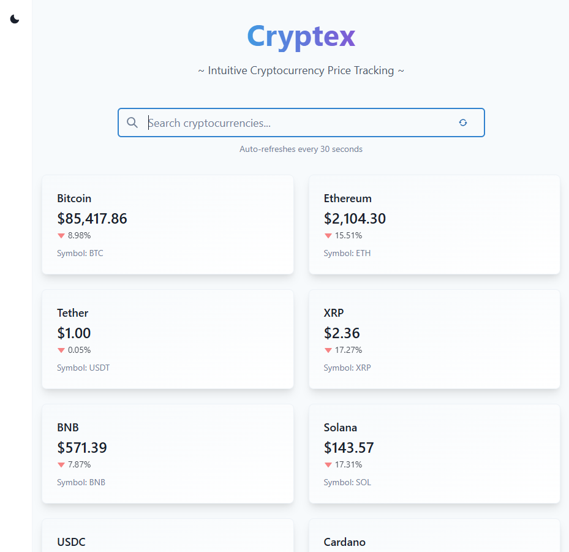

# Cryptex Technical Documentation

## Overview




Cryptex is built with a modern React stack focusing on performance, maintainability, and developer experience.

## Technical Implementation

### State Management with React Query

I chose React Query for state management because it provides built-in cache management with automatic background refetching. This simplifies real-time data updates and reduces boilerplate code.

### API Integration

The application uses CoinCap's API for real-time cryptocurrency data, selected because of free API calls and comprehensive price data:

```typescript
interface CryptoAsset {
  id: string;
  rank: string;
  symbol: string;
  name: string;
  priceUsd: string;
  changePercent24Hr: string;
}

const getCryptoPrices = async (limit: number): Promise<CryptoAsset[]> => {
  const response = await axios.get(`${COINCAP_API}/assets`, {
    params: { limit }
  });
  return response.data.data;
};
```

### UI Components Architecture

1. **Layout Component**
   - Handles theme switching
   - Responsive container
   - Navigation sidebar

2. **CryptoCard Component**
   - Displays individual cryptocurrency data
   - Animated transitions
   - Responsive design
   - Theme-aware styling

## Challenges & Solutions

### 1. Real-time Data Updates

**Challenge**: It was important to provide real-time price updates without overwhelming the API or the client, dealing with rate limits.

**Solution**: 
I implemented intelligent caching with React Query and added configurable refresh intervals. Additionally, I included the manual refresh button. 

### 2. Performance Optimization

**Challenge**: Handling frequent updates without impacting performance.

**Solution**:
I decided to implement debounced search with React Query's caching. I also optimized re-renders with memo.

### 3. Theme Management

**Challenge**: Consistent theming across components with smooth transitions.

**Solution**:
I selected Chakra UI for centralized theme management and used smooth transitions for crypto tiles and assets. 


## Potential Future Improvements

1. **Features**
   - Price alerts
   - Portfolio tracking
   - Historical data visualization

2. **Technical**
   - Server-side rendering optimization
   - Progressive Web App support
   - E2E testing implementation

## Deployment

1. **Prerequisites**
   - Node.js environment
   - Environment variables
   - Build configuration

2. **Process**
   ```bash
   # Build the application
   npm run build

   # Start production server
   npm run start
   ```

